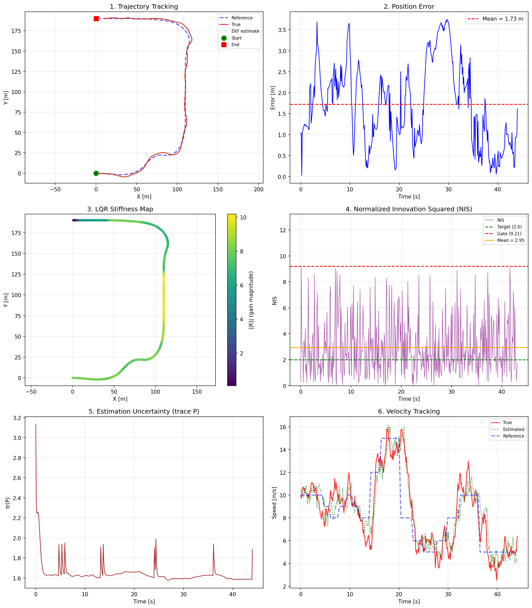

# CTRV EKF-LQR: Optimal Trajectory Control Under Sensor Noise

A closed-loop autonomous vehicle control system that keeps a ground vehicle on a reference path when its only position information comes from noisy GPS.

The system solves two coupled problems: **estimating where the vehicle actually is** (despite sensor noise) and **computing the minimum-effort steering commands** to bring it back on track. Both problems are instances of optimal inference under uncertainty — the mathematical framework that underlies robotics, autonomous systems, and any platform that has to act on imperfect real-world data.



*Six-panel output: trajectory tracking (top-left), position error over time (top-right), LQR gain magnitude along the track (middle-left — note higher gains at corners), filter health via NIS (middle-right), estimation uncertainty (bottom-left), velocity tracking (bottom-right).*

---

## What the System Does

A 5-state vehicle model tracks position (x, y), speed, heading, and yaw rate around a COTA-inspired racetrack with S-curves, a long straight, and a hairpin. The vehicle receives noisy GPS measurements every 100ms. From those measurements alone it must stay within ~1.8m of the reference path at speeds up to 15 m/s.

**Stage 1 — State Estimation (EKF / UKF)**

The vehicle's true position is hidden — only noisy observations are available. The filter maintains a probability distribution over possible states and updates it every timestep by fusing the dynamics model prediction with the new sensor measurement. The Kalman gain optimally weights model confidence against sensor confidence.

Two estimators are implemented and interchangeable:
- **EKF** (Extended Kalman Filter): linearizes the nonlinear vehicle dynamics at each step via a numerical Jacobian, then applies the standard linear Kalman update
- **UKF** (Unscented Kalman Filter): propagates 11 deterministically chosen sigma points through the full nonlinear model, recovering mean and covariance without linearization

**Stage 2 — Optimal Control (LTV-LQR)**

Given the state estimate, the controller computes the minimum-cost acceleration and yaw commands to minimize tracking error. It solves a finite-horizon quadratic cost problem by sweeping the Riccati recursion backward from the terminal condition:

```
S_k = R + B_k^T P_{k+1} B_k
K_k = S_k^{-1} B_k^T P_{k+1} A_k
P_k = Q + A_k^T P_{k+1} (A_k - B_k K_k)
```

Gains are curvature-scheduled: tighter corners use higher position weights and lower yaw-accel penalty, allowing aggressive steering where the geometry demands it. The LQR stiffness map (panel 3) shows this working — gains are visibly higher at the S-curves and hairpin.

---

## Key Engineering Decisions

**Why the backward Riccati recursion instead of DARE per step**

The original notebook called `scipy.linalg.solve_discrete_are` at every timestep. This failed ~50 times per run because individual linearized systems at high-curvature sections were not stabilizable in isolation. The backward sweep solves one global optimization over the whole trajectory — the cost-to-go propagates corner awareness backward in time, so the controller starts preparing for the hairpin before it arrives.

**Why the Q matrix needs a lateral disturbance term**

Process noise for a vehicle is dominated by longitudinal acceleration uncertainty, which projects through heading as `[cos(ψ), sin(ψ), ...]`. At ψ=0°, this gives `Q[y,y] = 0` — the filter believes it has zero uncertainty in the lateral direction. A filter that confident ignores lateral measurement corrections entirely, causing gradual divergence. Adding 10% lateral disturbance noise through the perpendicular direction `[-sin(ψ), cos(ψ), ...]` guarantees Q is full rank at every heading.

**Why numerical Jacobians in the EKF**

The analytical Jacobian was derived for the uncontrolled baseline model (constant yaw rate, first-order heading). The controlled plant integrates heading to second order (`½αΔt²`) and uses updated velocity/yaw-rate in the arc formula. The mismatch is ~0.8% per step in position-heading partial derivatives — small but accumulating over hundreds of steps. The numerical Jacobian is computed from the actual controlled dynamics, eliminating the model-controller inconsistency.

---

## Results

| Configuration | Mean Error | Max Error | Stable (10 seeds) |
|---|---|---|---|
| Original notebook | Diverged ~30s | — | — |
| Bug fixes only | 6.74 m | ~18 m | 8/10 |
| Wider actuator bounds + LQR retune | 3.17 m | 7.7 m | 6/10 |
| + Curvature scheduling + error clamp | 3.04 m | 8.6 m | 10/10 |
| + IMU heading sensor (5°) | 2.27 m | 2.6 m | 10/10 |
| + Softened track geometry | **1.78 m** | **2.0 m** | **10/10** |

---

## Quickstart

```bash
git clone <repo>
cd ctrv-ekf-lqr
pip install -r requirements.txt

# Run with default settings (UKF + softened track + IMU heading)
python scripts/run_simulation.py

# Save plot to a specific path
python scripts/run_simulation.py --save my_results.png

# Compare EKF vs UKF
python scripts/run_simulation.py --estimator ekf --save ekf_results.png
python scripts/run_simulation.py --estimator ukf --save ukf_results.png

# GPS-only (no IMU heading)
python scripts/run_simulation.py --no-heading

# Run tests
python -m pytest tests/ -v
```

---

## Codebase

```
ctrv/
├── constants.py    State indices, dimensions, noise defaults, track geometry
├── model.py        CTRV dynamics (controlled + baseline), analytical + numerical Jacobians
├── noise.py        Heading-dependent CWNA process noise Q(ψ)
├── ekf.py          EKF and UKF estimators, NIS diagnostics
├── lqr.py          LTV linearization, backward Riccati sweep, curvature scheduling
└── trajectory.py   Reference path generation from waypoints (cubic spline + ramp smoothing)

scripts/
├── run_simulation.py   Main closed-loop simulation and 6-panel dashboard
└── tune_ekf.py         NIS-based Q/R parameter sweep

tests/
└── test_all.py         25 unit tests (model, noise, EKF, UKF, LQR)
```

---

## Background

This project started as a final project for an applied numerical methods course, implementing EKF + LQR from scratch in a single notebook. The original notebook diverged at t≈30s due to three bugs:

1. **Q rank deficiency** — longitudinal-only noise projection produces Q[y,y]=0 at ψ=0
2. **Jacobian–dynamics mismatch** — analytical Jacobian derived for uncontrolled model, applied to controlled plant
3. **DARE failure** — solving an infinite-horizon problem at each step of a time-varying trajectory

The refactored codebase fixes all three, adds the UKF, implements curvature-scheduled gains, and packages everything with a test suite. The core mathematics is unchanged — the same EKF predict-update cycle and Riccati recursion from the notebook — just implemented correctly and robustly.

---

## Dependencies

```
numpy >= 1.24
scipy >= 1.10
matplotlib >= 3.7
```
